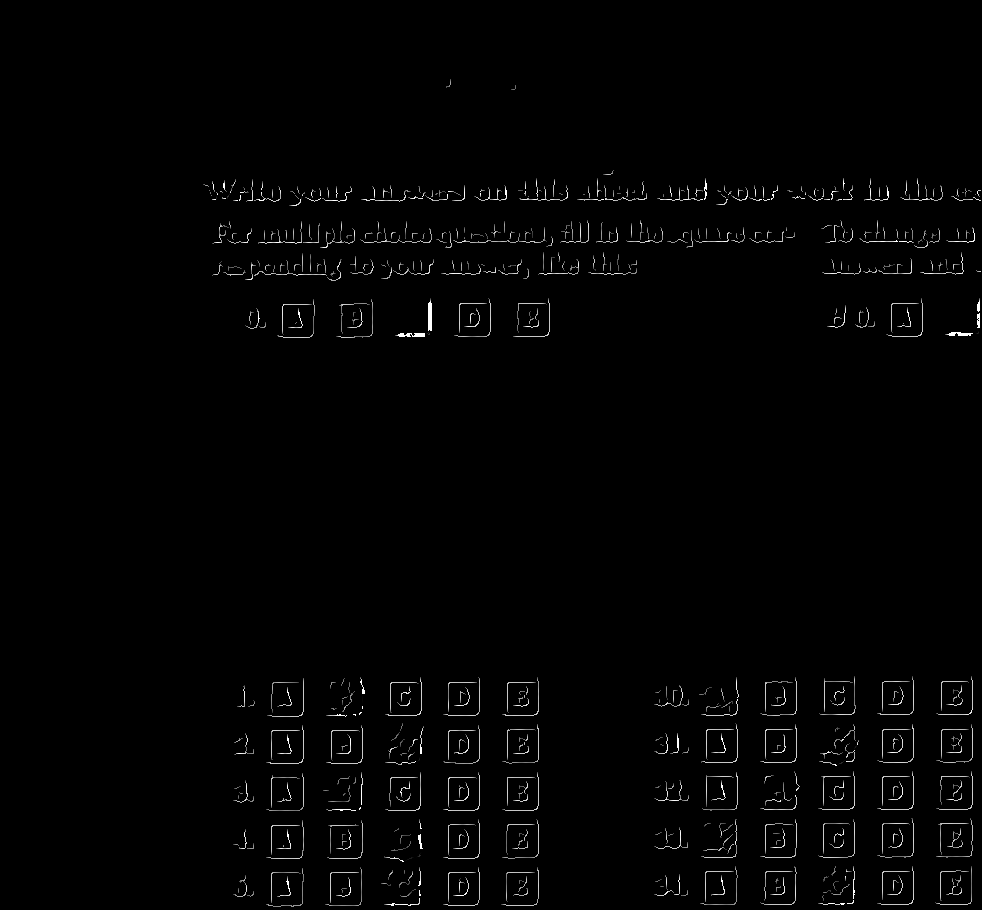

# A1 


## Task1: Grading 

### Methods

1. Load the input image and convert it to grayscale. Let's use the following image as an example: 

    <div align="center">
    	
    </div>

2. Canny edges detection: 

    - **Gaussian filter**. It is used to remove the noise. 

    - **Calculate gradient value and gradient direction**. The gradient in x-direction $G_x$ and y-direction $G_y$ can be calculated by Sobel filters. Then the gradient value and gradient direction can be calculated as: 
      $$
      \text{gradient value} = \sqrt{G_x^2 + G_y^2}
      $$

      $$
      \text{gradient direction} = \tan^{-1}(G_x/G_y)
      $$

      The gradient in x-direction, gradient in y-direction and gradient value are shown in following figures. 

      <div align="center">
      	
      </div>

      <div align="center">
      	
      </div>

      <div align="center">
      	
      </div>

    - **Non-maximum suppression**. We suppress the non-maximum pixels along the gradient direction, then the edges will be narrowed. 

      <div align="center">
      	
      </div>

    - **Use upper and lower thresholds to detect edges**. If the edge pixels are larger than the high threshold, it is contained in the strong edges. If the edge pixels are smaller than the low threshold, they will be removed from the edge. The other edge pixels are the weak edges. In the end, if a weak edge pixel is next to a strong edge pixel, it is also contained in the strong edges. Here shows the final result of strong edges. 

      <div align="center">
      	
      </div>

    The functions of Canny edges detection is defined in `edge_detection.py`. You can check the functions by `python edge_detection.py test.png`, and the result is saved in `test_canny.png`. Every step can be visualized by the commented out codes below `# visualization`. Here is the inputs and outputs of the function: 

    ```python
    def canny_edge_detect(img, lth, hth):
        '''
        Input: 
            img:        <PIL Image>
            lth, hth:   <int/float> Low and high thresholds.
        Output: 
            edge:       <numpy array>
        '''
    ```

    Also, we first tried the `ImageFilter.FIND_EDGES`, it will detect thick lines, which is not accuracy enough. Hence, we use the Canny edge detection in the final codes.  

3. Line detection in Hough space: 

    - **Set the title space to blank**. Because we only need to handle one type of sheet, we could assume that the title space is fixed. It is removed to reduce noise as shown in the following figure.  

      <div align="center">
      	
      </div>

    - **Hough transform**. For each point in x,y-space, we compute its distance ($r$) between origin point at angle $\theta$. 
      $$
      r = x \cos{\theta} + y \sin{\theta}
      $$

    - **Find maximums in each small Hough area (lines in x,y-space)**. We split the Hough space into small areas, and only the maximum point in the area will be detected as a line. This avoids detecting a lot of lines that are close to each other. The area size is flexible, here we adjust it to $30$. The maximums are colored in yellow in the following figure. 

      <div align="center">
      	
      </div>

    - **Back Transform**. The maximums are transferred back to x,y-space,  then we will get the lines shown in green. 

      <div align="center">
      	
      </div>

    The functions of line detection is defined in `hough_detection.py`. You can check the functions by `python hough_detection.py test.png`, and the result is saved in `test_lines.png`. Every step can be visualized by the commented out codes below `# visualization`. Here is the inputs and outputs of the function: 

    ```python
    def hough_line_detect(edges, th, area_size, r_dim=400, theta_dim=400): 
        '''
        Input: 
            edges:      <numpy array> The non-zero value represents the edge.
            th:         <int/float> The threshold of pick the pixel in Hough space.
            area_size:  <int> For one area, only one pixel will be picked.
            r_dim:      <int> The range of r. 
                        The larger it is the result will be more accurate.
            theta_dim:  <int> The range of theta. 
                        The larger it is the result will be more accurate.
        Output:
            high_points: <list> A list of detected lines. Each line is represented 
                        by its intercept, (a, b).
        '''
    ```

4. Calculate the final answers: 

    - **Modified the lines**. 

      - We find the horizontal line and the vertical line which also fit that the distance between the first and second line is `mesh_size` as the beginning of our meshes. 
      
      - We assume that the vertical lengths are fixed, and modify the horizontal lines one by one using the first horizontal line as an anchor. Here are the configures we use: 

      ```python
      config = {'title_len': 600, 
                'mesh_size': 32, # meshes are squares
                'choice_num': 5,
                'question_num': 85, 
                'answer_dict': ['A', 'B', 'C', 'D', 'E'],
                'row_num': 29, 
                'col_num': 3, 
                'margin_hor_min': 27,
                'margin_hor_max': 163,
                'margin_ver': 15,
                'margin_space': 46}
      ```

      The meshes we construct is shown in red rectangles in the following figure. The yellow rectangles are considered as the extra answers. 

      <div align="center">
      	
      </div>

    - **Calculate the pixels in each squares' mesh**. If the red rectangle is filled more than 25%, we record it as chosen. Otherwise, it is recorded as un-chosen. 

    - **Calculate the pixels in the left outsides the mesh**. If there is a mark larger than 100 pixels in the yellow rectangle, we will record that there is a extra answer as 'x'. 

### Evaluate

Please use the following commands for test: 

```bash
# python3 grade.py form.jpg output.txt
# an example
python3 grade.py ./img/test.png output_test.txt

python3 grade.py ./test-images/a-3.jpg ./test-outputs/output_a-3.txt
python3 grade.py ./test-images/a-27.jpg ./test-outputs/output_a-27.txt
python3 grade.py ./test-images/a-30.jpg ./test-outputs/output_a-30.txt
python3 grade.py ./test-images/a-48.jpg ./test-outputs/output_a-48.txt
python3 grade.py ./test-images/b-13.jpg ./test-outputs/output_b-13.txt
python3 grade.py ./test-images/b-27.jpg ./test-outputs/output_b-27.txt
python3 grade.py ./test-images/c-18.jpg ./test-outputs/output_c-18.txt
python3 grade.py ./test-images/c-33.jpg ./test-outputs/output_c-33.txt
```

All the output files are saved in the `./test-outputs/`, and we have set up the groundtruth files in `./test-images/`. Then the outputs can be evaluated by: 

```bash
python3 grade_eval.py ./test-outputs/ ./test-images/
```

Or use the simple one command to test and eval all the inputs:

```bash
bash grade_all.sh
```

The final results are:

```bash
a-27: right: 80, wrong: 5, accuracy: 0.9411764705882353
a-3: right: 75, wrong: 10, accuracy: 0.8823529411764706
a-30: right: 84, wrong: 1, accuracy: 0.9882352941176471
a-48: right: 73, wrong: 12, accuracy: 0.8588235294117647
b-13: right: 74, wrong: 11, accuracy: 0.8705882352941177
b-27: right: 85, wrong: 0, accuracy: 1.0
c-18: right: 83, wrong: 2, accuracy: 0.9764705882352941
c-33: right: 69, wrong: 16, accuracy: 0.8117647058823529
```

The average execution time for each sheet is about 20 mins. The most time consuming part is Hough transform. Reducing `r_dim` and `theta_dim` in Hough line detection will speed up but decrease the accuracy of the results. 

## Task2: Hidden the information 

Task 2 can be divided into two part: Injection and Extraction

### Injection

Step 1: Check size and scale of image. To remove additional complexity convert Convert RGB Image to gray scale Image.

Step 2: Read the groundtruth values and store in file_data. To reduce the storage bits: 
Convert ABCDE into binary formal A is 10000, B is 01000, C is 00100, D id 00010 and E is 0

Step 3:Now to handle multiple choice behavior of the questions we perform bitwise OR for each 85 questions and store as final_data.# Interleaved 2 of 5 barcode : Used to convert numerical data into wide and narrow space and bars. Where, W is Wide bar, w is wide space, N is Narrow bar and n is narrow space.

Step 4: Since, our input digits and output length of string of ones and zeros are constant we came up with a rectangle of size 800 x 80 (l x h).

    *  800 x 80 aproximates to 2737*5*5
    *  This rectangular regionn is represents 1's and 0's in the form of 5 x 5 squares 
    *  Fllowing are the x (l) and y (h) values
    
    *  x is from 400 to 1200
    *  y is from 470 to 550
    *  Now take gray scale input blank image to add modified 2D barcode with a bounding box of width 10 pixel. 

<div align="center">
      	
      </div>

```bash
python3 inject.py blank_form.jpg a-3_groundtruth_injected.txt injected.jpg
```
#### Output Image

<div align="center">
      	
      </div>

This injection takes on average 0.22 seconds of time.

### Extraction

#### Detection and extraction of hidden data in the form of 2D barcode:
This python file is used to extract answer key that is injected in the form of Modified 2 D barcode (QR code) and write it in _output file.
### Printing and scanning

We tried printing, injection, filling the blank sheet (with hidden answers) and scanning of the image.

<div align="center">
      	
      </div>

After this we added bounding box that can be robust to small rotations caused during scanning of the image. To become robust to the increased resolution of the scanned image resized them.

Step 1: Resize the input image. Convert the image to gray scale.

```bash
config = {'title_end': 365 ,'body_start': 600}
```
### Methods
Step 2: Canny Edge Detection

**Set the title and answering space to blank** since we just need to detect the barcode. 
Before:

<div align="center">
      	
      </div>
After:

```bash
edges[:config['title_end'], :] = 0
edges[config['body_start']:, :] = 0   
```

<div align="center">
      	
      </div>

Step 3: Corner Detection : Returns bounding box corner and returns None if blank image.

```bash
with Image.open("title.png") as title:
        if title.getbbox() == None:
            print("Image is empty")
        (left, upper, right, lower) = title.getbbox()
        print(left, upper, right, lower)
```
Step 4: Use this method to loact the START and STOP of the encoding :
```bash
Here x and y will range based on left, upper, right and lower
def detect_raw(x,y)
```
Step 5: Decoding the IFT 2 of 5 interleaved barcode encoding:

```bash
START = "NnNn"
    STOP = "WnN"

    
    CODES = {
        "NNWWN" : 0 ,
        "WNNNW" : 1,
        "NWNNW" : 2,
        "WWNNN" : 3,
        "NNWNW" : 4,
        "WNWNN" : 5,
        "NWWNN" : 6,
        "NNNWW" : 7,
        "WNNWN" : 8,
        "NWNWN" : 9,
    }
```
### Evaluate

For evaluation comparing injected_groundtruth.txt with injected_output.txt file to get following results:

```bash
python3 grade_injection.py ./test-outputs/ ./test-images/

```

```bash

a-30: right: 78, wrong: 7, accuracy: 0.9176470588235294
a-27: right: 84, wrong: 1, accuracy: 0.9882352941176471
c-33: right: 85, wrong: 0, accuracy: 1.0
c-18: right: 85, wrong: 0, accuracy: 1.0
a-3: right: 84, wrong: 1, accuracy: 0.9882352941176471
b-13: right: 81, wrong: 4, accuracy: 0.9529411764705882
a-48: right: 73, wrong: 12, accuracy: 0.8588235294117647
b-27: right: 83, wrong: 2, accuracy: 0.9764705882352941
```

Running time is on average 62.87 seconds for extraction. 


